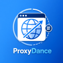
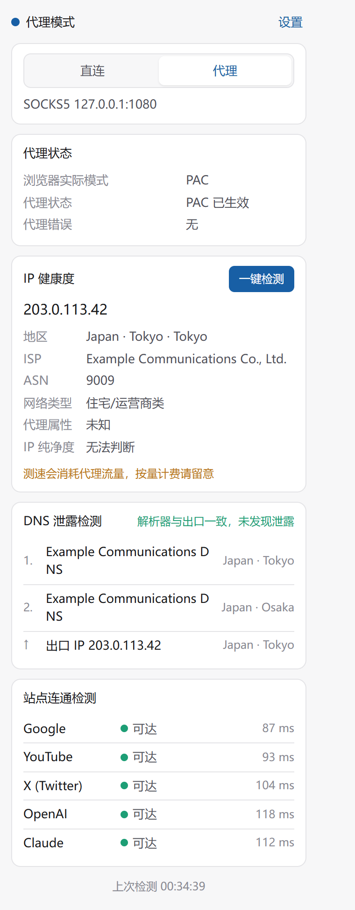
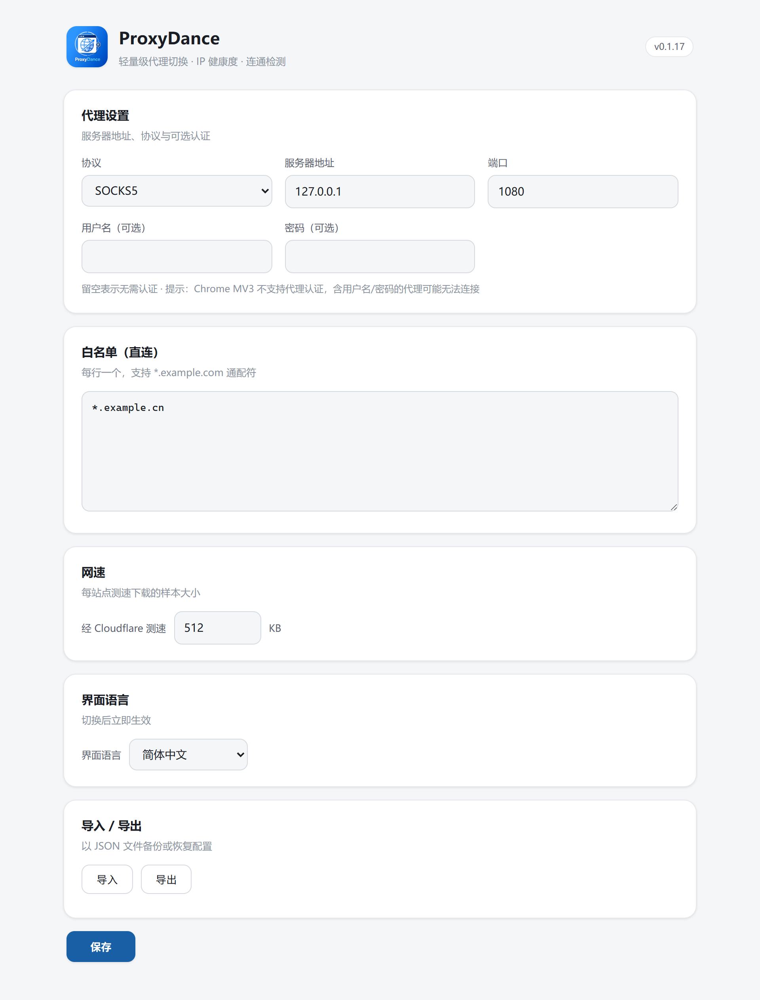

  

<h1 align="center">ProxyDance</h1>

  轻量级代理切换 × 隐私检测 · Chrome MV3 扩展

  <a href="README.md">中文</a> | <a href="README.en.md">English</a>
   
  
  
  
  

---

ProxyDance 在「直连」与自有代理服务器(HTTP / HTTPS / SOCKS4 / SOCKS5)之间一键切换,并把一次网络体检集成进弹出页:出口 IP 健康度、DNS 泄露检测、主流站点连通测试。**不提供、不售卖代理服务,不收集任何用户数据。**

## 截图

  
  

## 功能

- **一键切换** — 直连 / 代理即时切换,工具栏图标颜色实时指示当前网站的流量去向(命中白名单自动变直连色)
- **IP 健康度** — 出口 IP、地区、ISP / ASN,以及「IP 纯净度」评级:识别容易被流媒体与 AI 服务风控的机房 / 代理 IP
- **DNS 泄露检测** — 验证域名解析是否发生在代理侧,按解析顺序列出实际使用的解析器及其地区
- **站点连通检测** — Google、YouTube、X、ChatGPT、Claude 的可达性、延迟与受限状态
- **Cloudflare 测速** — 可选的下载速度采样
- **通配符直连白名单** — `*.example.com` 语法,PAC 由扩展安全生成(模式经白名单校验,杜绝脚本注入)
- **配置导入 / 导出**、**中英文界面**、**深色模式**

## 灵感来源与改进

ProxyDance 的灵感来自经典代理切换扩展 [SwitchyOmega](https://github.com/FelisCatus/SwitchyOmega)(22k+ star),在此向作者 [FelisCatus](https://github.com/FelisCatus) 及社区致敬。本项目是**独立实现,非其 fork**。

与 SwitchyOmega 的取舍:

| | SwitchyOmega | ProxyDance |
|---|---|---|
| 定位 | 全功能代理管理器(多 profile、自动切换规则) | 单代理 + 网络体检,专注轻量 |
| 架构 | Manifest V2,**已停止维护** | **Manifest V3**,持续演进 |
| 隐私检测 | 无 | IP 纯净度评级、DNS 泄露检测、站点连通 |
| 体量 | 大型项目 | ~1,500 行 TypeScript,零运行时依赖 |

功能对比:**SwitchyOmega 解决「怎么切换」,ProxyDance 额外回答「切换之后,我的出口环境干不干净」。**

## 安装
**方式一：Chrome浏览器应用商店扩展程序**（推荐）

[Chrome 应用商店](https://chromewebstore.google.com/category/extensions)上线申请中，敬请期待！

**方式二：下载 Release 包**

1. 从 [Releases](https://github.com/JanF2024Curr/ProxyDance/releases) 下载最新的 `proxydance-*.zip` 并解压
2. 打开 `chrome://extensions`,开启右上角「开发者模式」
3. 「加载已解压的扩展程序」→ 选择解压出的目录

## 快速上手

1. **配置** — 打开设置页,填入你的代理服务器地址与端口,保存
2. **切换** — 点击工具栏图标,在弹窗中切换「代理 / 直连」
3. **检测** — 点击「一键检测」,查看 IP 健康度、DNS 泄露与站点连通结果

> 注意:Chrome MV3 的 PAC 机制不支持代理认证。需要用户名 / 密码的代理请在服务端放行,或使用本地转换(如 gost / clash 混合端口)。

## 隐私

ProxyDance **不收集、不存储、不上传任何用户数据**。检测请求(含你的出口 IP)仅在你主动点击「一键检测」时,直接发往以下第三方服务:

| 服务 | 用途 |
|---|---|
| ipwho.is / ipinfo.io | IP 归属与 ASN 查询 |
| bash.ws | DNS 泄露检测 |
| speed.cloudflare.com | 可选测速 |

## 许可

[GPL-3.0](LICENSE) © ProxyDance contributors

## 致谢

- [FelisCatus/SwitchyOmega](https://github.com/FelisCatus/SwitchyOmega) — 代理切换扩展的经典之作,本项目的产品形态受其直接启发
- [bash.ws](https://bash.ws) / [ipwho.is](https://ipwho.is) / [ipinfo.io](https://ipinfo.io) / [Cloudflare](https://www.cloudflare.com) — 免费检测数据服务
